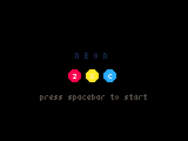

# NEON

개요
----
> 개발 언어 : Python  
> 개발 엔진 : pyxel (https://github.com/kitao/pyxel)  
> 개발 기간 : 2019.03.05 ~ 2019.03.06  

게임 방법
---------
1. 원이 채워지는 속도에 맞춰 키를 누릅니다.  
2. 정확하게 키를 눌렀을 때 점수가 올라갑니다.  
3. 키를 잘못 누르거나 타이밍을 놓쳤을 경우에는 점수가 올라가지 않고, life 게이지가 떨어집니다.  
4. life 게이지가 0이 되면 게임이 종료됩니다.  
5. 주어진 시간 동안 life 게이지를 유지하는 것에 성공하면 레벨이 올라갑니다.  
